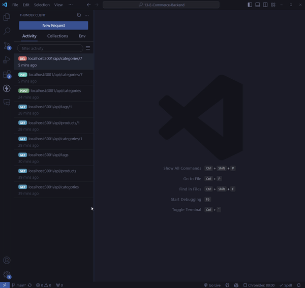

# E-Commerce Backend 🛒🚀

Welcome to my E-Commerce Backend project! This application is designed to provide a comprehensive backend solution for e-commerce websites, allowing for easy management of products, categories, and tags. Built with Express.js, Sequelize, and MySQL, it offers a robust API for performing CRUD operations on your e-commerce data.

## Features 🌟

- **Product Management**: Add, view, update, and delete products.
- **Category Management**: Organize products into categories for easy navigation.
- **Tag Management**: Assign tags to products to improve searchability.
- **Sequelize ORM**: Utilizes Sequelize for database management, making data retrieval and manipulation a breeze.
- **Express.js API**: Fast and scalable API endpoints.

## Basic Installation 💾

1. Clone the repository to your local machine.
2. Run `npm install` to install the necessary dependencies.
3. Set up your MySQL database and configure the `.env` file with your MySQL user, password, and database name.
4. Run `npm run seed` to seed the database with sample data.
5. Start the server with `npm start`.

## Demo 📸

or watch the full video on YouTube [here](https://youtu.be/UtxGTi-fMDI)!

## Database Setup 🗃️

This application uses a MySQL database to store product, category, and tag data. You will need to set up a MySQL database and configure the `.env` file with your MySQL user, password, and database name.

Once your database is set up, you can use the `npm run seed` command to seed the database with sample data. This will create sample products, categories, and tags in the database to help you get started.

## Database Schema 📊

The database schema for this application is as follows:

- **Product**: Represents a product in the e-commerce store.
- **Category**: Represents a category that products can be organized into.
- **Tag**: Represents a tag that can be assigned to products.
- **ProductTag**: Represents the relationship between products and tags.

The relationships between these tables are as follows:

- A product belongs to one category, and a category can have many products.
- A product can have many tags, and a tag can be assigned to many products.

## Usage 🚀

Once the server is running, you can use API testing tools like Postman or Insomnia to test the API endpoints.

The API endpoints for this application are as follows:

- **GET /api/products**: Retrieves all products.
- **GET /api/products/:id**: Retrieves a single product by its ID.
- **POST /api/products**: Creates a new product.
- **PUT /api/products/:id**: Updates a product by its ID.
- **DELETE /api/products/:id**: Deletes a product by its ID.
- **GET /api/categories**: Retrieves all categories.
- **GET /api/categories/:id**: Retrieves a single category by its ID.
- **POST /api/categories**: Creates a new category.
- **PUT /api/categories/:id**: Updates a category by its ID.
- **DELETE /api/categories/:id**: Deletes a category by its ID.
- **GET /api/tags**: Retrieves all tags.
- **GET /api/tags/:id**: Retrieves a single tag by its ID.
- **POST /api/tags**: Creates a new tag.
- **PUT /api/tags/:id**: Updates a tag by its ID.
- **DELETE /api/tags/:id**: Deletes a tag by its ID.

## Technologies Used 🛠️

- Node.js
- Express.js
- MySQL
- Sequelize ORM
- Dotenv for environment variable management

## License 📄

This project is licensed under the MIT License - see the [LICENSE](LICENSE) file for details.

## Contact Me 📧
Questions? Comments? Feel free to reach out to me at the following:

Email: [DanTCathey@gmail.com](mailto:DanTCathey@gmail.com)

GitHub: [Indexal](https://github.com/Index-al)

---

Thanks for checking out my app! 🎉